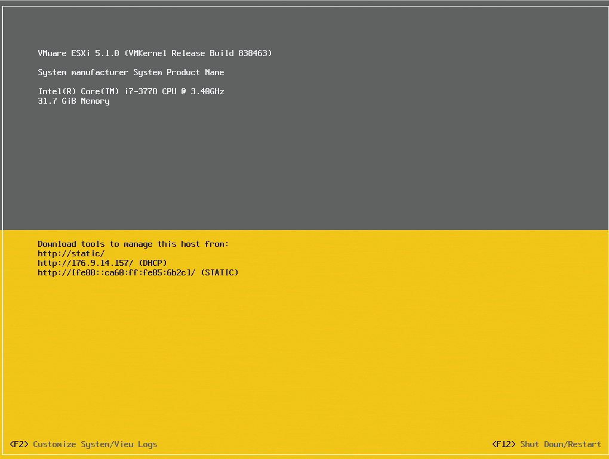

# How to install VMware vSphere (ESXi)

## Introduction

VMware vSphere, formerly known as VMware ESXi, is a virtualization product by
VMware which provides a hypervisor to run virtual machines on bare-metal
hardware.

**Limitations**

* software RAID is not supported
* NAT and routing are not supported
* Using a subnet requires setting up a router VM on a additional single IP

**License**

After installation the system has a 60-day test license. For the long-term use
an individual license is required. A free single node license can be requested
by registering on the [VMware website](https://www.vmware.com/products/vsphere-hypervisor.html)

## Compatibility

The Dell PowerEdge models DX150, DX151, DX290, DX291  and DX141 are certified
and compatible with all versions from 5.0 onwards. DX152 and DX292 are
compatible from 6.5 onwards.
All other models are not certified by VMware, yet in most cases VMware vSphere/ESXi can be
installed.

The following table lists all currently known working models and versions
(information is subject to change)

| Model                             | vSphere/ESXi Version              |
|-----------------------------------|---------------------------------|
| AX50-SSD/AX60-SSD                 | from 6.5a (additional NIC required) |
| AX160                             | from 6.5a                         |
| PX92                              | from 6.5                          |
| PX91/PX121                        | from 5.5 Update 1                 |
| PX90/PX120                        | from 5.1                          |
| PX61                              | from 5.5 Update 3 / 6.0 Update 2  |
| PX61-NVMe                         | from 6.0 Update 2                 |
| PX60/PX70                         | from 5.5 Update 1                 |
| EX61/EX61-NVMe                    | from 6.5                          |
| EX41/EX41S/EX51/EX42\             | from 5.5 Update 3 / 6.0 Update 2 (may require additional NIC)
| EX40/EX60                         | 5.0 - 5.1 Update 2, since 5.5 (additional NIC required)
| EX6/EX6S/EX8/EX8S                 | from 5.0                          |
| EX4/EX4S/EX10                     | from 5.0 (additional NIC required)    |
| EQ4/EQ6/EQ8/EQ9                   | 5.0 - 5.1 Update 2, since 5.5 (additional NIC required) |


The models mentioned above should work with the appropriate version.
Newer versions may not be compatible.

Using a custom installation ISO with 3rd party / community drivers may allow
installation without adding a compatible network card. Creating such an ISO is
out of scope for this guide.

## Step 1 - Installation

When ordering the desired server, make sure to select "Rescue System" to ensure
no other operating system present on the drives. If needed a RAID controller
can be added on non-NVMe models during the order process.  It must be
configured prior to the installation. After the server has been provisioned,
request a KVM console via [Hetzner Robot](https://robot.your-server.de). Using
the KVM Console allows to connect a virtual DVD drive to the server from which
vSphere can be installed.

Insert the ISO into the virtual drive and boote the server from the image.  The
installer only requires answers to a few questions like locale, root password
and target drive.

Once the installation is completed and the server has booted the installed system, you will be greeted
with a welcome screen.

To log in use the password that you entered during the installation. This is
the root password for SSH as well as the password for the VMware vSphere Web Client.



## Network configuration

Before installing a virtual machine, additional IP addresses for these
instances can be ordered via Hetzner Robot.  Either in form of a limited number
of single IP addresses or for larger quantities in form subnets. Please note
that using subnets will require setting up a virtual machine to act as router.

When using single IP addresses, you must request a dedicated virtual MAC address for each IP.
via Hetzner Robot. Configure the assigned MAC addresses in the network card settings
of the virtual machine. Once this is done, the virtual machine can be installed and will receive
its network settings via DHCP from the Hetzner network.


More instructions.
### Code Example
```javascript
var s = "JavaScript syntax highlighting";
alert(s);
```
 
```python
s = "Python syntax highlighting"
print s
```

## Step 3 - &lt;summary of step>

More instructions.

### Terminology
* Hostname: `<your_host>`
* Domain: `<example.com>`
* IPv4: `<10.0.0.1>`
* IPv6: `<2001:db8:1234::1>`

## Step N - &lt;summary of step>

More instructions.

## Conclusion

<!--
At the end of your tutorial, once the user has completed all steps, you can add a short conclusion.
Summarize what the user has done, and maybe suggest different courses of action they can now take.
-->
