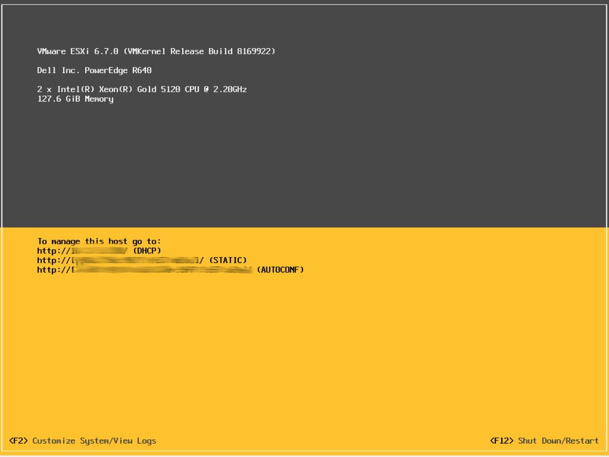
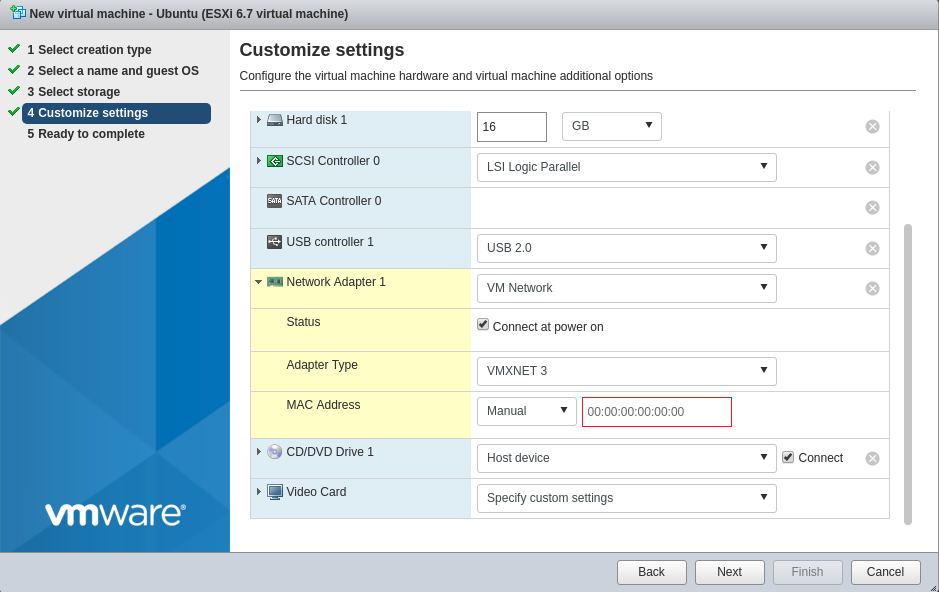

# How to install VMware vSphere (ESXi)

## Introduction

VMware vSphere, formerly known as VMware ESXi, is a virtualization product by
VMware which provides a hypervisor to run virtual machines on bare-metal
hardware.

**Limitations**

* software RAID is not supported
* NAT and (internal) routing are not supported
* Using a subnet requires setting up a router VM on a additional single IP

**License**

After installation the system has a 60-day test license. For the long-term use
an individual license is required. A free single node license can be requested
by registering on the [VMware website](https://www.vmware.com/products/vsphere-hypervisor.html)

## Compatibility

The Dell PowerEdge models DX150, DX151, DX290, DX291  and DX141 are certified
and compatible with all versions from 5.0 onwards. DX152 and DX292 are
compatible from 6.5 onwards.
All other models are not certified by VMware, yet in most cases VMware vSphere/ESXi can be
installed.

The following table lists all currently known working models and versions
(information subject to change)

| Model                 | VMware vSphere (ESXi) Version                                 |
|-----------------------|---------------------------------------------------------------|
| AX50-SSD/AX60-SSD     | from 6.5a (additional NIC required)                           |
| AX160                 | from 6.5a                                                     |
| PX92                  | from 6.5                                                      |
| PX91/PX121            | from 5.5 Update 1                                             |
| PX90/PX120            | from 5.1                                                      |
| PX61                  | from 5.5 Update 3 / 6.0 Update 2                              |
| PX61-NVMe             | from 6.0 Update 2                                             |
| PX60/PX70             | from 5.5 Update 1                                             |
| EX61/EX61-NVMe        | from 6.5                                                      |
| EX41/EX41S/EX51/EX42  | from 5.5 Update 3 / 6.0 Update 2 (may require additional NIC) |
| EX40/EX60             | 5.0 - 5.1 Update 2, since 5.5 (additional NIC required)       |
| EX6/EX6S/EX8/EX8S     | from 5.0                                                      |
| EX4/EX4S/EX10         | from 5.0 (additional NIC required)                            |
| EQ4/EQ6/EQ8/EQ9       | 5.0 - 5.1 Update 2, since 5.5 (additional NIC required)       |


The models mentioned above should work with the appropriate version.
Newer versions may not be compatible.

Using a custom installation ISO with 3rd party / community drivers may allow
installation without adding a compatible network card. Creating such an ISO is
out of scope for this guide.

## Installation

When ordering the desired server, make sure to select "Rescue System" to ensure
no other operating system present on the drives. If needed a RAID controller
can be added on non-NVMe models during the order process.  It must be
configured prior to the installation. After the server has been provisioned,
request a KVM console via [Hetzner Robot](https://robot.your-server.de). Using
the KVM Console allows to connect a virtual DVD drive to the server from which
vSphere can be installed.

Insert the ISO into the virtual drive and boot the server from the image.  The
installer only requires answers to a few questions like locale, root password
and target drive.

Once the installation is completed and the server has booted the installed system, you will be greeted
with a welcome screen.

To log in use the password that you entered during the installation. This is
the root password for SSH as well as the password for the VMware vSphere Web Client.



## Network configuration

Before installing a virtual machine, additional IP addresses for these
instances can be ordered via Hetzner Robot.  Either in form of a limited number
of single IP addresses or for larger quantities in form subnets. Please note
that using subnets will require setting up a virtual machine to act as router.

For connectivity between multiple ESXi servers within the same
public Hetzner subnet, host routes via gateway are necessary due to network
security restrictions.

```bash
# host A
esxcfg-route -a <IP Host B> 255.255.255.255 <gateway IP>

# host B
esxcfg-route -a <IP Host A> 255.255.255.255 <gateway IP>
```

### Using single IP addresses

When using single IP addresses for virtual machines, you must request a dedicated virtual MAC address for each IP.
via Hetzner Robot. Configure the assigned MAC addresses in the network card settings
of the virtual machine. Once this is done, the virtual machine can be installed and will receive
its network settings via DHCP from the Hetzner network.




### Using Subnets

Using a subnet requires at least on additional single IP address which must be
setup with a virtual machine that will function as a router for the subnet.
When ordering a subnet, please make sure to add a note to request it should be
routed to the additional single IP address.

**IPv4**

The confirmation mail for the subnet will contain add required information, for example:

```
Below you will find the IP subnet added to your server 192.168.13.156.

Subnet: 192.168.182.16 /28
Mask: 255.255.255.240
Broadcast: 192.168.182.31

Usable IP addresses:
192.168.182.17 to 192.168.182.30
```

As the subnet is routed to the additional single IP, no dedicated virtual MAC address are required 
and can neither be requested.

**IPv6**

All servers come with a /64 IPv6 subnet. To see which IPv6 subnet your
server has please check the \"IPs\" tab of the server in
[Hetzner Robot](https://robot.your-server.de).

The IPv6 subnet is routed to the default link-local address (which is derived
from the MAC address) of the main IP. Via [Hetzner
Robot](https://robot.your-server.de) the routing of the IPv6 subnet can be
switched to the link-local address of the virtual MAC (in other words, the
additional single IP). This can be done in [Hetzner
Robot](https://robot.your-server.de), using the same symbol which is found next
to additional single IPs to request virtual MAC addresses. In this case, the
host running vSphere receives no IPv6 address. This is neither necessary nor
possible because ESXi does not work with an `fe80::1` gateway.

In order to use IP addresses from a subnet in virtual machines, a dedicated
*router VM* supplemented by an additional virtual network card from the new
subnet is necessary. The subnet itself requires a new vSwitch to which all
virtual machines in the subnet must be connected.
